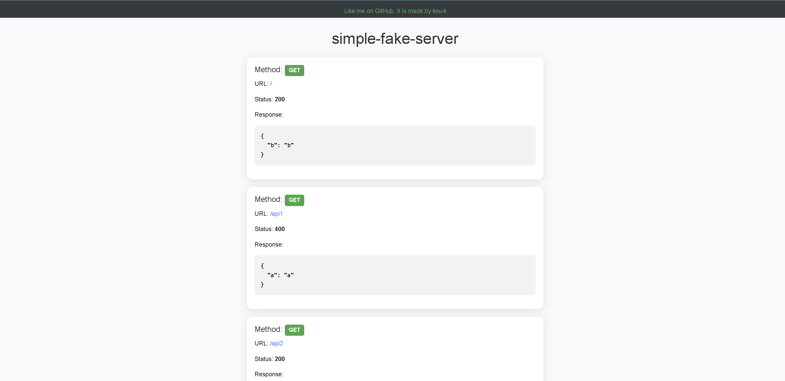

# Fake-Server

## 사용법

### 1. 패키지 설치

```
npm i
or
npm ci
```

### 2. fake endpoint 구성

```
./fake-server/config.json
```

에 들어가서 설정한다.

> #### `fake-server/config` 에 대한 간단한 설명
>
> -   `method` 는 요청 시 사용할 메소드이다. (get,post, put, delete 등)
> -   `url` 은 endpoint 위치를 의미한다.
> -   `responseStatus`는 응답 상태코드를 의미한다.
> -   `response` 는 응답 시 받는 데이터이다.

### 3. 프로젝트 실행

```
npm start
```

###

## 대시보드 ( /fake-server/ui )



위와 같이 `fake-api` 에 대한 명세를 간단하게 대시보드화하여 볼 수 있다.

## 사용 기술

-   express.js
-   pug engine
